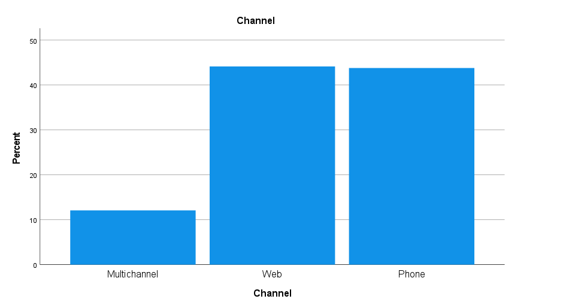
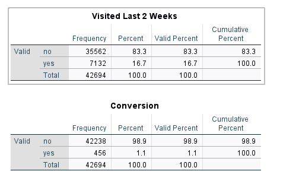
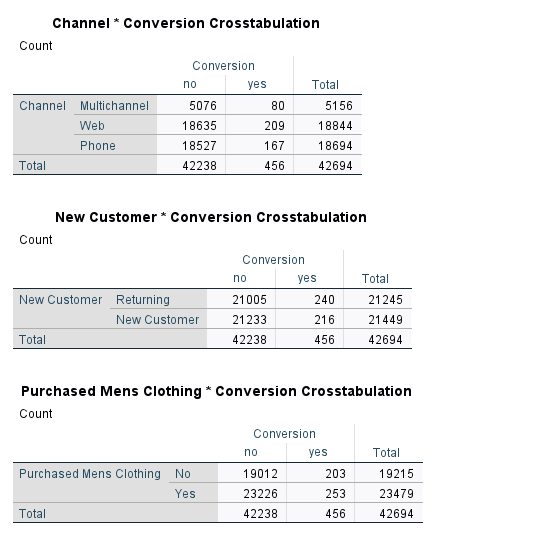
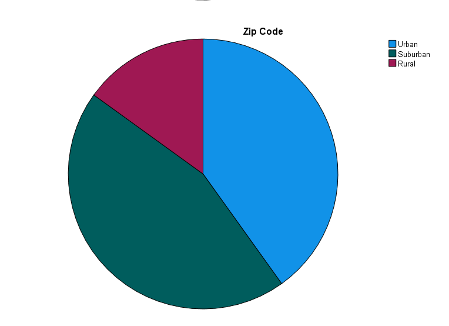
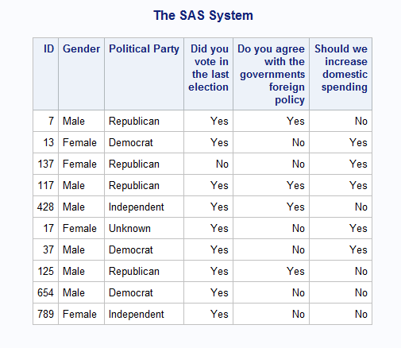
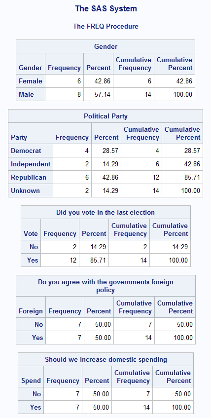
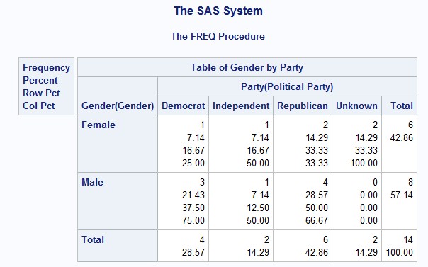

# HW 2

## SPSS

According to the data, we can see that most of the users coming to the website
were from either web or phone, and very little from multichannel. Further advertisements
should therefore focus on web and phone advertisements.  

  

We can also see that the email advertisements are not very effective, as only
1.1% of people purchased product form the website in the following two weeks,
and only 16% actually visited the site.  

  

Here, we can see that the most likely people to buy from the email, (albeit on a very
small margin) are those from the web. We can also see that there was roughly an equal amount of returning and
new customers that bought from the store. Finally, we also see that there was an equal purchase of men's
and women's clothing.  

  

Lastly, we also observe that the two most popular customer demographics are Urban and Suburban, equally
distributed. With all this information, we can better spend money on advertisements by purchasing
advertising that specifically targets those in Suburban and Urban locations, on phone and web for both
men's and women's clothing.



# SAS

  
    
    
```sas
DATA mylib.polit;
        infile "C:\Users\jgb38\Downloads\PoliticalParty.txt";
        input ID 1-3 Gender $4 Party $5 Vote 6 Foreign 7 Spend 8;
        run;
data mylib.political;
	set mylib.polit;
	run;

PROC FORMAT library=mylib;
        VALUE $Gender
                'M'='Male'
                'F'='Female';
        VALUE $Party
                'D'='Democrat'
                'R'='Republican'
				'U'='Unknown'
                'I'='Independent';
        VALUE yesno
                0='No'
                1='Yes';
run;


PROC PRINT DATA=mylib.political (obs=10) label noobs;
        OPTIONS FMTSEARCH=(mylib);
		LABEL Gender='Gender';
		LABEL Party='Political Party';
		LABEL Vote='Did you vote in the last election';
		LABEL Foreign='Do you agree with the governments foreign policy';
		LABEL Spend='Should we increase domestic spending';
		FORMAT Gender $Gender. Party $Party. Vote yesno. Foreign yesno. Spend yesno.;
run;

PROC FREQ DATA=mylib.political;
	OPTIONS FMTSEARCH=(mylib);
	LABEL Gender='Gender';
	LABEL Party='Political Party';
	LABEL Vote='Did you vote in the last election';
	LABEL Foreign='Do you agree with the governments foreign policy';
	LABEL Spend='Should we increase domestic spending';
	FORMAT Gender $Gender. Party $Party. Vote yesno. Foreign yesno. Spend yesno.;
	TABLE Gender Party Vote Foreign Spend;
	run;
PROC FREQ DATA=mylib.political;
	OPTIONS FMTSEARCH=(mylib);
	LABEL Gender='Gender';
	LABEL Party='Political Party';
	FORMAT Gender $Gender. Party $Party.;
	TABLES Gender*Party;
	run;
```
