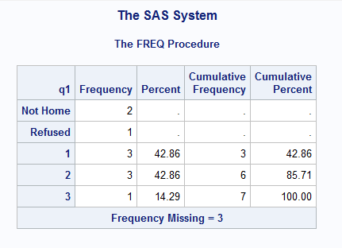
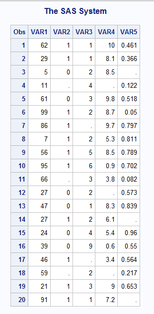
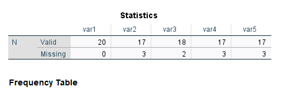
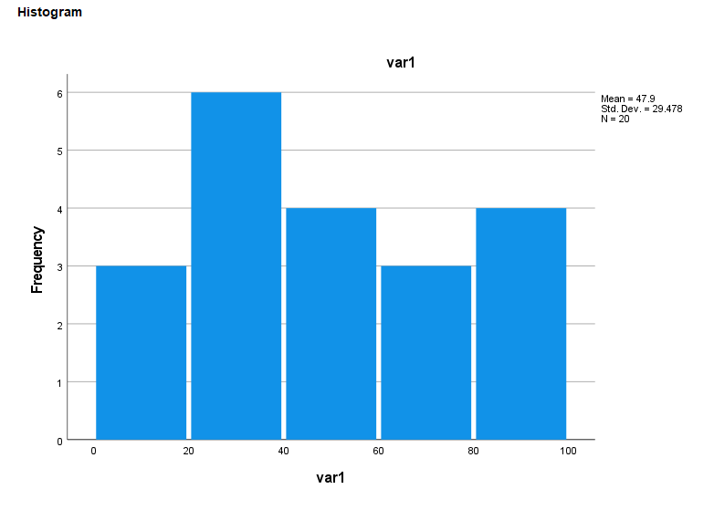
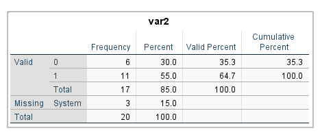
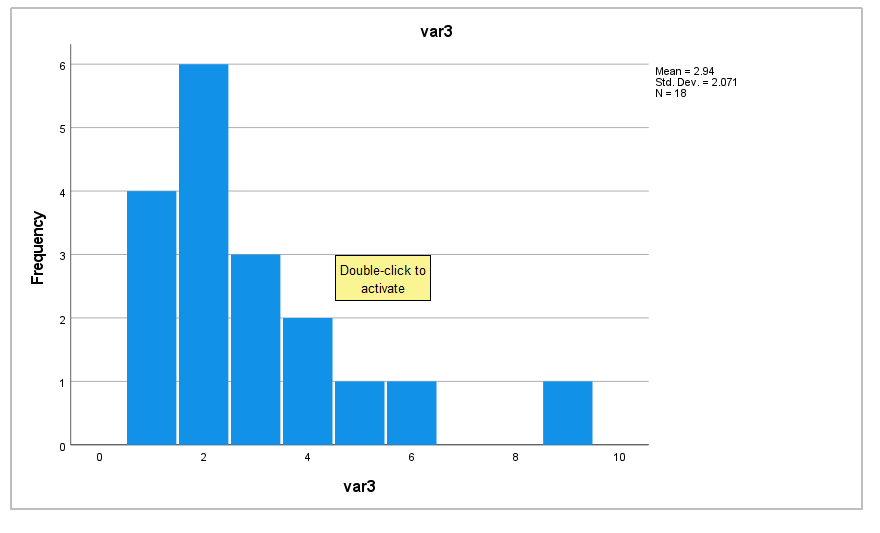
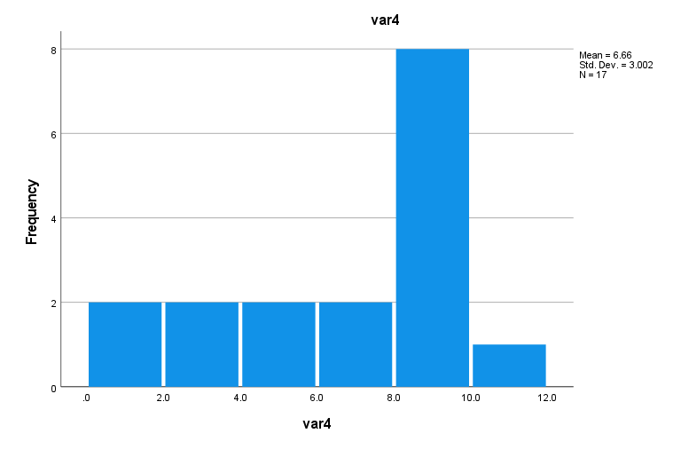
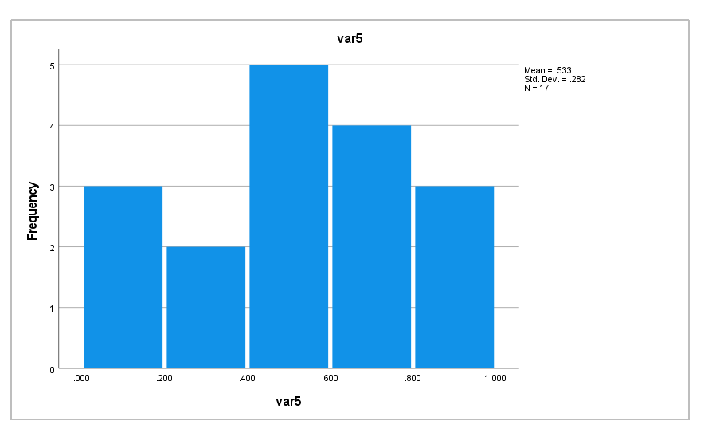

# HW3

### Problem 1

```sas
if age < 20 then agecat=1;
else if age < 50 then agecat=2;
else if age ge 50 then agecat=3;
else if age =. then agecat=9;
```  

Since missing values are represented internally as infinitely small,
a missing value will always be considered agecat 1. To solve this, we
can re-order the way the if statement is structured to catch missing values first.

```sas
if age =. then agecat=9;
else if age < 20 then agecat=1;
else if age < 50 then agecat=2;
else if age ge 50 then agecat=3;
```

### Problem 2

```sas
DATA mylib.survey;
INPUT ID q1;
MISSING A R;
IF q1 = 'A' THEN q1=.A;
ELSE IF q1 = 'R' THEN q1=.R;
CARDS;
8401 2
8402 A
8403 1
8404 1
8405 2
8406 3
8407 A
8408 1
8409 R
8410 2
;
RUN;
PROC FORMAT library=mylib;
	VALUE missing
		.A='Not Home'
		.R='Refused';
		RUN;
PROC FREQ DATA = mylib.survey;
	OPTIONS FMTSEARCH=(mylib);
	FORMAT q1 missing.;
	TABLES q1 / MISSPRINT;
	RUN;
```



### Problem 3

```sas
PROC IMPORT out=mylib.misdata datafile='C:\Users\jgb38\Downloads\missing.txt' dbm=dlm ;
  delimiter='09'x;
RUN;
DATA result;
	SET mylib.misdata;
	ARRAY X _numeric_;
	do i = 1 to dim(X);
	if X[i] = -999 then X[i] = .;
	if X[i] = -99 then X[i] = .;
	end;
	drop i;
RUN;

PROC PRINT data=result;
RUN;
```



### Problem 4

```spss
DATASET ACTIVATE DataSet1.
RECODE var1 var2 var3 var4 var5 (-999=SYSMIS) (-99=SYSMIS).
EXECUTE.
```








