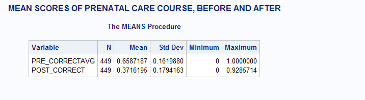

# HW4

First, I read in the contents of the file into a dataset, assigning only the values needed for test scores.



According to the data, The mean score went dramatially down after the seminar.
The educational seminar seems to have confused the participants causing them to yeild
incorrect answers. To arrive at this conclusion, I scored each student by their average of correct vs incorrect answers, and took the average of that score against all students to get the group average.
In both cases, it seems that some participants failed to anser the questions at all.

The code is as follows:  
```sas
DATA mylib.hw4;
INFILE 'C:\Users\jgb38\Downloads\DataHW4.txt'
firstobs=5;
INPUT pq1 59 pq2 60 pq3 61 pq4 62 pq5 63 pq6 64 pq7 65

pq8 66 pq9 67 pq10 68 pq11 69 pq12 70 pq13 71 pq14 72 pq15 73

pq16 74  pq17 75 pq18 76 pq19 77 pq20 78 pq21 79 postq1 79 postq2 80

postq3 81 postq4 82 postq5 83 postq6 84 postq7 85 postq8 86 postq9 87 postq10 88

postq11 89 postq12 90 postq13 91 postq14 92;

IF pq1 = 1 THEN pans1 = 1;

ELSE pans1 = 0;

IF pq2 = 1 THEN pans2 = 1;

ELSE pans2 = 0;

IF pq3 = 2 THEN pans3 = 1;

ELSE pans3 = 0;

IF pq4 = 2 THEN pans4 = 1;

ELSE pans4 = 0;

IF pq5 = 1 THEN pans5 = 1;

ELSE pans5 = 0;

IF pq6 = 1 THEN pans6 = 1;

ELSE pans6 = 0;

IF pq7 = 2 THEN pans7 =1;

ELSE pans7 = 0;

IF pq8 = 2 THEN pans8 = 1;

ELSE pans8 = 0;

IF pq9 = 2 THEN pans9 = 1;

ELSE pans9 = 0;

IF pq10 = 1 THEN pans10 = 1;

ELSE pans10 = 0;

IF pq11 = 1 THEN pans11 = 1;

ELSE pans11 = 0;

IF pq12 = 1 THEN pans12 = 1;

ELSE pans12 = 0;

IF pq13 = 1 THEN pans13 = 1;

ELSE pans13 = 0;

IF pq14 = 1 THEN pans14 = 1;

ELSE pans14 = 0;

IF pq15 = 1 THEN pans15 = 1;

ELSE pans15 = 0;

IF pq16 = 1 THEN pans16 = 1;

ELSE pans16 = 0;

IF pq17 = 1 THEN pans17 = 1;

ELSE pans17 = 0;

IF postq1 = 1 THEN posttstans1 = 1;

ELSE posttstans1 = 0;

IF postq2 = 1 THEN posttstans2 = 1;

ELSE posttstans2 = 0;

IF postq3 = 2 THEN posttstans3 = 1;

ELSE posttstans3 = 0;

IF postq4 = 2 THEN posttstans4 = 1;

ELSE posttstans4 = 0;

IF postq5 = 1 THEN posttstans5 = 1;

ELSE posttstans5 = 0;

IF postq6 = 1 THEN posttstans6 = 1;

ELSE posttstans6 = 0;

IF postq7 = 2 THEN posttstans7 =1;

ELSE posttstans7 = 0;

IF postq8 = 2 THEN posttstans8 = 1;

ELSE posttstans8 = 0;

IF postq9 = 2 THEN posttstans9 = 1;

ELSE posttstans9 = 0;

IF postq10 = 1 THEN posttstans10 = 1;

ELSE posttstans10 = 0;

IF postq11 = 1 THEN posttstans11 = 1;

ELSE posttstans11 = 0;

IF postq12 = 1 THEN posttstans12 = 1;

ELSE posttstans12 = 0;

IF postq13 = 1 THEN posttstans13 = 1;

ELSE posttstans13 = 0;

IF postq14 = 1 THEN posttstans14 = 1;

ELSE posttstans14 = 0;

PRE_AVG=MEAN(pans1,pans2,pans3,pans4,pans5,pans6,pans7,pans8,pans9,pans10,pans11,pans12,pans13,pans14,pans15,pans16,pans17);

POST_AVG=MEAN(posttstans1,posttstans2,posttstans3,posttstans4,posttstans5,posttstans6,posttstans7,posttstans8,posttstans9,posttstans10,posttstans11,posttstans12,posttstans13,posttstans14);

RUN;

PROC MEANS DATA = mylib.hw4;

VAR PRE_AVG POST_AVG;

TITLE 'MEAN SCORES OF PRENATAL CARE COURSE';

RUN;
```
