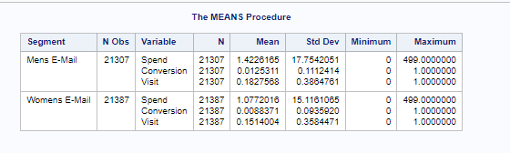
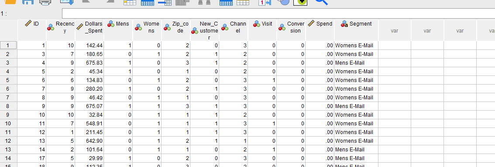
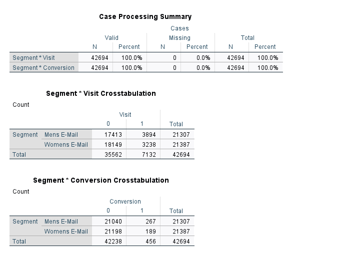
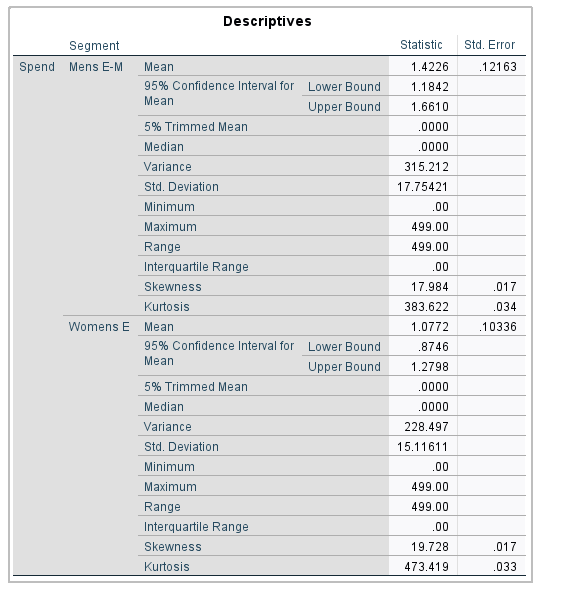

# HW 5

### Excell  
Part A:  
First, I downloaded both datasets into the same folder called Email Test. Next I selected `Get Data` -> `From File` -> `From Folder`
and selected the folder with both .csv files. I then loaded it into excell, and had successfully combined the datasets.

Part B:  
To merge variable information, I entered `=XLOOKUP(A2,'Email Indicator'!$A:$A,'Email Indicator'!$B:$B)` into a new column called `Mens/Women`
This command, as per Microsoft, is an upgraded version of the vlookup command. A2 is the variable I want to look up, the next argument is
the cells i want to search, and fianlly the last paramater is the values i want to get back.

Part C:  
The mens Email campaign seems to have been much more successfull than the womens campaign. On all metrics (Total visits, Money Spent in the following weeks, and total conversion) the mens campaign out performed the womens.  


### SAS

```sas
PROC IMPORT DATAFILE='/home/u62253726/sasuser.v94/EmailIndicator.csv'
	OUT=mylib.indicator
	replace;
RUN;

PROC IMPORT DATAFILE='/home/u62253726/sasuser.v94/EmailTest1.csv'
	OUT=mylib.email1
	replace;
RUN;
PROC IMPORT DATAFILE='/home/u62253726/sasuser.v94/EmailTest2.csv'
	OUT=mylib.email2
	replace;
RUN;

DATA mylib.emailtemp;
	SET mylib.email1 mylib.email2;
RUN; 

PROC SORT
	DATA=mylib.emailtemp;
	BY ID;
RUN;

PROC SORT
	DATA=mylib.indicator;
	BY ID;
RUN;


DATA mylib.email;
	MERGE mylib.emailtemp mylib.indicator;
	BY ID;
RUN; 

PROC FREQ
	DATA=mylib.email;
	TABLES Segment*Conversion Segment*Visit;
RUN;

PROC MEANS
	DATA=mylib.email;
	VAR Spend Conversion Visit;
	CLASS Segment;
	OUTPUT out=MEAN;
RUN;

PROC PRINT
	DATA=MEAN
	noobs;
RUN;
```

SAS data also points to Mens email doing better in all areas. Men spent an average of $1.42,
while women spent an average of $1.07. This is skewed since most people did not actually buy products, infact only around 1% actually bought product
in the following two weeks after the email campaign. Lastly, it shows that men visited the site slightly more than women did, where 9.12% of men visited the site from the email, where only 7.58% visited from the womens email




### SPSS

According to SPSS output, the statistics look about identical to the Excell reports, with the men beating the women on most fronts. According to SPSS,
Men spent about .5c more on average. Again, as with excell, these are skewed since most people did not buy products. Men were more likely to make purchases from the site, at 267 vs womens 189 conversions.




