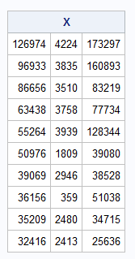
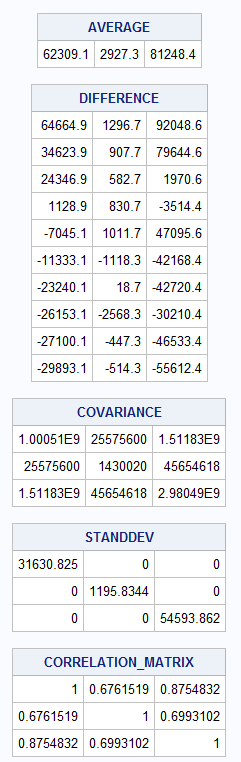

# SAS

  


```sas
PROC IML;
	X={126974 4224 173297
	   ,96933 3835 160893
	   ,86656 3510 83219
	   ,63438 3758 77734
	   ,55264 3939 128344
	   ,50976 1809 39080
	   ,39069 2946 38528
	   ,36156 359 51038
	   ,35209 2480 34715
	   ,32416 2413 25636};
	print X;
	AVERAGE = 1:3;
	DIFFERENCE = j(10,3);
	do i = 1 to 3;
		AVERAGE[i] = SUM(X[, i]) / 10;
		DIFFERENCE[, i] = X[, i]-AVERAGE[i];
	end;
	PRINT AVERAGE;
	PRINT DIFFERENCE;
	COVARIANCE = j(3,3);
	COVARIANCE = (t(DIFFERENCE) * DIFFERENCE) / 9;
	PRINT(COVARIANCE);
	STANDDEV = sqrt(DIAG(COVARIANCE));
	PRINT(STANDDEV);
	CORRELATION_MATRIX = j(3,3);
	CORRELATION_MATRIX = inv(STANDDEV) * COVARIANCE * inv(STANDDEV);  
	PRINT(CORRELATION_MATRIX );
QUIT;
```

### SPSS
```spss
MATRIX.
COMPUTE X={
    126974, 4224, 173297;
    96933, 3835, 160893;
    86656, 3510, 83219;
    63438, 3758, 77734;
    55264, 3939, 128344;
    50976, 1809, 39080;
    39069, 2946, 38528;
    36156, 359,  51038;
    35209, 2480, 34715;
    32416, 2413, 25636}.

COMPUTE TX = T(X).
COMPUTE ones  = make(10,1,1).
COMPUTE onest = T(ones).
COMPUTE onexone = (ones*onest)/10.
COMPUTE identity = IDENT(10).

COMPUTE centmat = (identity - onexone).
PRINT centmat.
COMPUTE variancemat = (TX*centmat*X )/10.
PRINT variancemat.

COMPUTE stddev =SQRT(MDIAG(DIAG(variancemat))).
PRINT stddev.
COMPUTE invstddev = INV(stddev).
COMPUTE correlationmat = invstddev*variancemat*invstddev.

PRINT  stddev.
PRINT invstddev.
PRINT  correlationmat.
END MATRIX.

```